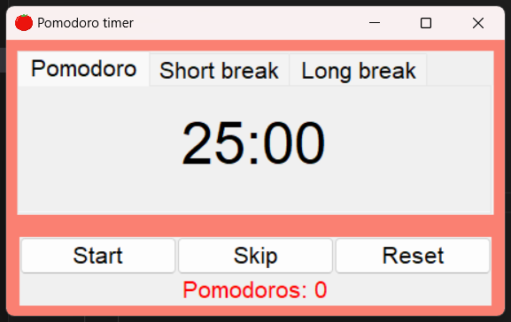

# Pomodoro Timer

This is a simple Pomodoro Timer desktop application built with Python and Tkinter. It helps you manage your time using the Pomodoro Technique, which involves working for a set period (usually 25 minutes) followed by a short break (5 minutes), and a longer break (15 minutes) after several work periods.

## Features

- Pomodoro timer (25 minutes)
- Short break timer (5 minutes)
- Long break timer (15 minutes)
- Automatic switching between work and break periods
- Pomodoro counter to track the number of completed pomodoros
- Start, skip, and reset buttons

## Usage

- Click the **Start** button to start the timer.
- Click the **Skip** button to skip the current timer period.
- Click the **Reset** button to reset the timer and pomodoro count.

